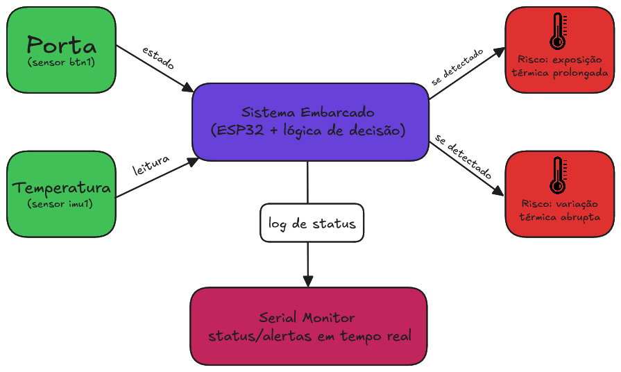
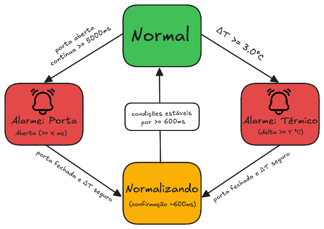
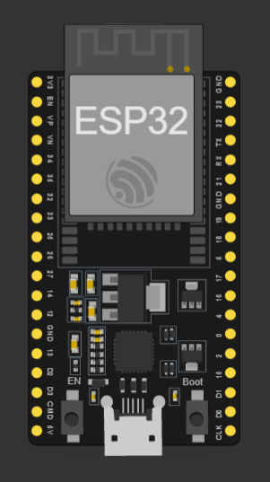
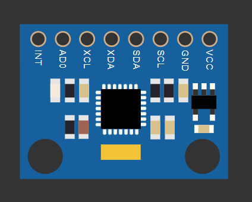
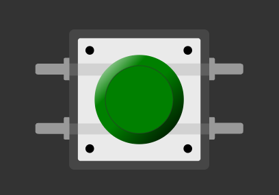
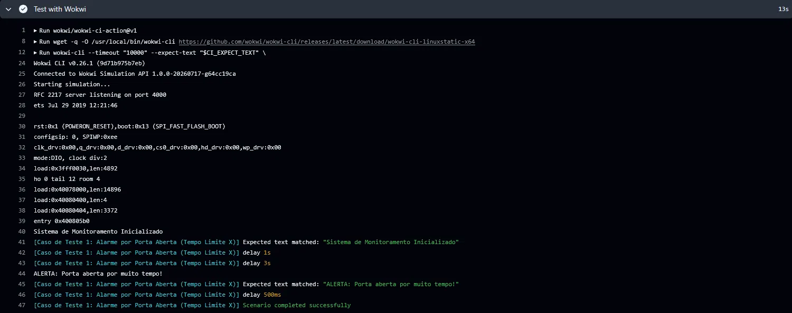
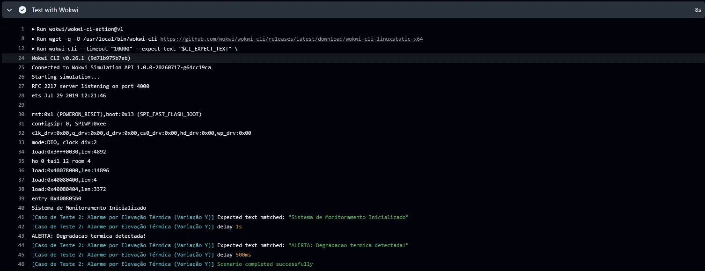
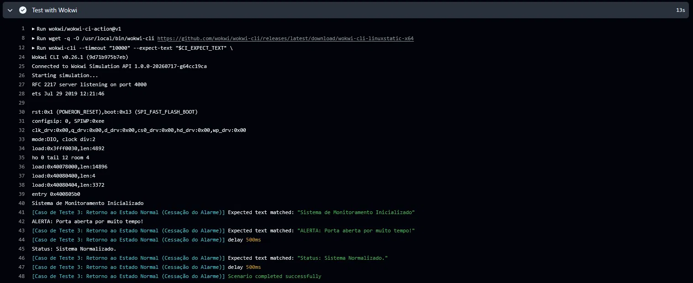

# Processo Seletivo – Intensivo Maker | IoT

## Etapa Prática – Sistemas Embarcados

Bem-vindo(a) à **etapa prática do processo seletivo para o Intensivo Maker | IoT**.

Esta atividade tem como objetivo avaliar suas competências em **Sistemas Embarcados**, com foco em **organização de projeto, lógica de firmware e simulação de hardware**, a partir da aplicação prática dos conhecimentos adquiridos nos cursos EAD da etapa anterior.

> **Objetivo principal**  
> Avaliar sua capacidade de **planejar, estruturar e desenvolver** uma solução funcional de sistemas embarcados, seguindo boas práticas de engenharia.

---

## Antes de Tudo

Se você **nunca utilizou Git ou GitHub**, não se preocupe.  
Siga atentamente os passos abaixo.

---

### 1 - Criação de Conta no GitHub

1. Acesse: <https://github.com>
2. Clique em **Sign up**
3. Crie sua conta gratuita seguindo as instruções da plataforma

> O GitHub será utilizado para:
>
> - Envio do seu projeto
> - Versionamento do código
> - Correção e validação automática via GitHub Actions

---

### 2 - Instalação do Git

O **Git** é a ferramenta responsável pelo controle de versões do seu código.

### Windows

Baixe e instale o **Git Bash**:  
<https://git-scm.com/downloads>

### Linux / macOS

Verifique se o Git já está instalado:

```bash
git --version
```

> Caso não esteja, instale pelo gerenciador de pacotes do seu sistema.

## Preparando o Ambiente

Para desenvolver o desafio, você deverá criar uma cópia deste repositório no seu GitHub.

### 1 - Fork do Repositório

No canto superior direito desta página, clique em Fork


Uma cópia do repositório será criada no seu perfil do GitHub

> O Fork permite que você trabalhe de forma independente, sem alterar o repositório original do processo seletivo.

### 2 - Clone do Repositório

No repositório do seu Fork, clique em **<> Code**


Copie a URL e execute no terminal:

```bash
git clone https://github.com/SEU_USUARIO/nome-do-repositorio.git
cd nome-do-repositorio
```

> O comando git clone cria uma cópia local do repositório para desenvolvimento.

### 3 - Preparação do Ambiente de Execução

Você pode executar o projeto de duas formas. Escolha apenas uma.

#### Opção A – Ambiente Python Local

**Requisitos:**

- Python 3.10 ou 3.11
- pip

**Instale as dependências:**

```bash
pip install -r requirements.txt
```

#### Opção B – Dev Container (Recomendado)

Este repositório inclui um Dev Container, garantindo um ambiente padronizado.

**Requisitos:**

- VS Code
- Docker instalado
- Extensão Dev Containers

**Passos:**

1. Abra o repositório no VS Code
2. Clique em “Reopen in Container”
3. Aguarde a criação automática do ambiente

> Todas as dependências serão instaladas automaticamente.

## Criando sua API Key do Wokwi

A simulação do projeto será executada automaticamente via GitHub Actions, utilizando o Wokwi CLI.

Para isso, você precisa gerar uma API Key.

1. Acesse: <https://wokwi.com/dashboard/ci>
2. Faça login (Google ou GitHub)
3. Clique em Generate API Token
4. Copie a chave gerada (exemplo: wokwi-xxxxxxxx)

> Importante

- Nunca faça commit dessa chave
- Ela deve ser armazenada apenas como secret no GitHub

## Configurando a API Key no GitHub (Secrets)

**No repositório do seu Fork:**

1. Vá em Settings
2. Acesse Secrets and variables → Actions
3. Clique em New repository secret
4. Nome: WOKWI_CLI_TOKEN
5. Valor: sua chave gerada
6. Salve

> As GitHub Actions do template já estão preparadas para usar essa variável automaticamente.

## Desafio Técnico

Você deverá desenvolver um projeto de sistemas embarcados simulados, utilizando Python e Wokwi.

### Estrutura mínima esperada

```text
/project
 ├── src/
 │   └── main.py        # Código principal do projeto
 ├── wokwi.toml         # Configuração da simulação
 ├── diagram.json       # Circuito no Wokwi
 └── README.md          # Explicação do seu projeto
```

> Você pode expandir essa estrutura se desejar, desde que mantenha os arquivos essenciais.

### Escolha do cenário

No diretório "scenarios" existem arquivos .md e pastas referentes a diferentes desafios. Selecione apenas um deles e mantenha apenas a pasta e .md referente ao desafio a ser desenvolvido, deletando os demais. Isso fará com o que o fluxo de testes automáticos selecione o fluxo de acordo com o desafio escolhido.

### Como Desenvolver seu Projeto

O desenvolvimento acontece principalmente nos arquivos abaixo:

#### src/main.py

- Código Python executado na simulação
- Implementa a lógica do sistema embarcado
- Exemplos: controle de LEDs, leitura de sensores, estados, temporizações, etc.

#### diagram.json

- Define o hardware virtual do projeto
- Componentes como:
  - LEDs
  - Botões
  - Sensores
  - Placa microcontroladora

#### wokwi.toml

- Configura a simulação:
  - Tipo de placa
  - Framework
  - Dependências adicionais
 
#### Rodando localmente

Para executar o seu projeto locamente, é necesário preparar a imagem docker local, e após isso
utiliza-la para gerar o arquivo que conterá o seu código para o projeto, para isso, execute os 
seguintes códigos:

1. Prepara a imagem docker (Necessário rodar apenas 1 vez)

```bash
docker build -t esp32-builder -f Dockerfile .
```

2. Prepara o arquivo de memória fs.bin (Necessário a cada iteração)

```bash
docker run --rm -v "$(pwd)/src:/mnt/src" -v "$(pwd):/mnt/out" esp32-builder bash -c "mkdir -p /tmp/fs && cp -r /mnt/src/* /tmp/fs/ && /mklittlefs/mklittlefs -c /tmp/fs -b 4096 -p 256 -s 0x200000 /mnt/out/fs.bin"
```

#### Commit e Push

Após suas alterações:

```bash
git add .
git commit -m "Descrição clara do que foi feito"
git push
```

### Execução Automática (GitHub Actions)

A cada push, o GitHub Actions irá automaticamente:

- Executar o pipeline de build
- Rodar a simulação via Wokwi CLI
- Validar que o projeto executa sem erros

### Caso algo falhe

- Vá até a aba Actions
- Analise os logs da execução
- Corrija e envie novamente

## Critérios de Avaliação

Esta etapa será avaliada considerando:

- Funcionamento correto da simulação
- Código organizado e legível
- Estrutura de arquivos correta
- Uso adequado do Wokwi
- Commits claros e bem descritos
- Projeto executando sem falhas nas Actions

---

## Submissão Final

Após concluir o desenvolvimento:

1. Verifique se o projeto **executa sem erros** nas GitHub Actions
2. Confirme que todos os arquivos obrigatórios estão presentes
3. Copie o link do **seu repositório no GitHub**

Envie o link conforme as orientações do processo seletivo na plataforma do **PNAAT**.

---

## Relatório do Candidato

O arquivo **`README.md` do seu repositório** deve ser utilizado como o  
**relatório final do desafio técnico**.

Preencha todas as seções abaixo de forma **clara, objetiva e técnica**.

> **Dica importante**  
> Não é necessário um relatório extenso.  
> O principal critério é demonstrar **clareza nas decisões técnicas**, organização e entendimento do sistema embarcado desenvolvido.
> Não mantenha os demais conteúdos escritos nesse arquivo README, aqui devem ser concentradas apenas informações referentes ao projeto desenvolvido.

---

## Identificação do Candidato
 
- **Nome completo:** Gustavo Ferreira Santos
- **GitHub:** https://github.com/gustavo-ferreirasantos

---
 
## Visão Geral da Solução

<p align="center"><p>
 
O projeto implementa um **Smart Cooler / Estufa**: um sistema embarcado para monitoramento de qualidade em ambientes refrigerados, estufas ou painéis elétricos, cujo objetivo é detectar duas condições de risco que podem levar à degradação de insumos ou sobreaquecimento de componentes:
 
1. **Exposição térmica prolongada** — a porta/tampa do ambiente permanecendo aberta por tempo excessivo, quebrando o isolamento físico;
2. **Variação térmica abrupta** — uma subida rápida de temperatura em relação a uma referência estável, indicando falha de refrigeração ou outra anomalia.
O usuário interage indiretamente com o sistema: ele apenas observa o log via Serial, que reporta em tempo real quando uma condição de risco é detectada e quando o ambiente volta ao normal. Não há atuadores (LEDs, buzzers) no escopo mínimo, o foco da solução é a lógica de decisão e a comunicação de status, que é o que os testes automatizados do Wokwi CI validam.
 
---
 
## Arquitetura do Sistema Embarcado
 
O `main.py` roda em um único laço principal (`while True`) inteiramente **não-bloqueante**: a cada iteração ele lê os sensores, atualiza o estado e dorme apenas `LOOP_DELAY_MS` (50 ms) antes da próxima leitura. Toda temporização é feita comparando timestamps com `time.ticks_ms()`/`time.ticks_diff()`, nunca com `time.sleep()` de duração longa — isso é essencial porque o Wokwi CI injeta estímulos (mudança do botão, mudança de temperatura) em instantes específicos da simulação, e qualquer bloqueio faria o firmware "perder" essas janelas.
 
Fluxo por iteração do loop:
 
1. **Leitura dos sensores** — estado do botão (`btn1`) e temperatura do MPU6050 (`imu1`).
2. **Detecção de transição da porta** — comparo o estado atual com o estado da iteração anterior para saber o exato instante em que ela fecha (isso importa para a lógica de referência térmica, explicada abaixo).
3. **Máquina de tempo de porta aberta** — se a porta está aberta, guardo o timestamp em que isso começou (`door_open_since`) e comparo o tempo decorrido com `LIMITE_TEMPO_X` (5000 ms).
4. **Máquina de gradiente térmico** — calculo `delta = temp_atual - temp_referencia` e comparo com `LIMITE_VARIACAO_Y` (3.0 °C).
5. **Máquina de normalização** — só zera os dois alarmes quando porta fechada **e** delta seguro ocorrem **simultaneamente**, com uma pequena janela de confirmação (ver Decisões Técnicas).
Os três alertas do sistema (`door_alarm_active`, `temp_alarm_active`) são flags independentes, mas a normalização depende do estado combinado das duas — refletindo o requisito de que "ambas as condições" precisam estar seguras ao mesmo tempo.
 

<p align="center"><p>

---
 
## Componentes Utilizados na Simulação
 
- **Microcontrolador (ESP32 DevKit C v4)** (`id: esp`) — microcontrolador principal, também conectado ao Serial Monitor virtual do Wokwi para os logs de status.
<p align="center"><p>

- **Sensor de Temperatura (MPU6050 IMU)** (`id: imu1`) — sensor de temperatura, usado aqui apenas pelo seu registrador de temperatura interno, conectado via I2C (SDA → GPIO21, SCL → GPIO22).
<p align="center"><p>

- **Botão / pushbutton** (`id: btn1`) — simula o fim-de-curso da porta, conectado ao GPIO4 com um resistor de pull-down (`r1`, 10kΩ) para GND. Fisicamente: pressionado = nível lógico alto (porta fechada); solto = nível lógico baixo (porta aberta) — o que casa com a convenção pedida no enunciado (`Pressionado/Fechado = 1`).

<p align="center"><p>

---
 
## Decisões Técnicas Relevantes
 
**Leitura direta de registrador em vez de biblioteca externa.** Em vez de depender de uma lib MicroPython de terceiros para o MPU6050, o código lê e converte a temperatura diretamente via I2C (registrador `0x41`, fórmula padrão do datasheet `Temp/340.0 + 36.53`). Isso reduz uma dependência externa no `requirements.txt`/imagem Docker e deixa o comportamento do sensor totalmente sob controle e auditável.
 
**Referência térmica capturada por transição, não por leitura contínua.** Esta foi a decisão mais importante do projeto, e surgiu de um bug real encontrado durante os testes: minha primeira versão atualizava `temp_referencia` a cada iteração do loop enquanto a porta estivesse fechada e sem alarme. Isso fazia a referência "perseguir" a leitura atual constantemente — quando o simulador mudava a temperatura de 20°C para 24°C, a referência já tinha virado 24°C antes mesmo do cálculo do delta rodar, e o alarme térmico nunca disparava (confirmado no log do CI: o `test_2` estourava timeout esperando `"ALERTA: Degradacao termica detectada!"`).
 
A correção: a referência agora só é recapturada em dois momentos:
1. No **instante exato da transição** de porta aberta → fechada (`transicao_para_fechada`), capturando a temperatura "no momento em que o ambiente selou";
2. Depois disso, só por um **rebaseline lento** (`REBASELINE_INTERVAL_MS = 3000`), permitindo acompanhar deriva térmica normal e lenta do ambiente sem mascarar picos abruptos.
**Janela de confirmação antes de normalizar.** Outro ajuste motivado por evidência empírica de log: o firmware reagia rápido demais (~50–100 ms) ao fechamento da porta, imprimindo `"Status: Sistema Normalizado."` ainda dentro da janela de `delay: 500ms` que o cenário de teste `test_3.yaml` usa entre fechar a porta e checar a mensagem — fazendo o `wait-serial` do CI perder a linha por uma questão de milissegundos. A correção foi introduzir `CONFIRMACAO_NORMALIZACAO_MS = 600`: o sistema só declara normalização depois que as duas condições ficam seguras por essa janela mínima, o que também funciona como um debounce realista para um sensor de porta físico (evita alternância espúria em uma transição instável).
 
**Constantes nomeadas em vez de números soltos.** Todos os limites (`LIMITE_TEMPO_X`, `LIMITE_VARIACAO_Y`, `LOOP_DELAY_MS`, `REBASELINE_INTERVAL_MS`, `CONFIRMACAO_NORMALIZACAO_MS`) são declarados no topo do arquivo, com comentário explicando o motivo de cada valor escolhido — facilita reajuste fino sem precisar caçar números mágicos espalhados pelo código.
 
**Tratamento defensivo de leitura I2C.** Toda leitura do MPU6050 é envolta em `try/except OSError`, evitando que uma falha pontual de comunicação I2C derrube o firmware inteiro no meio da simulação.
 
---
 
## Resultados Obtidos
 
O projeto passa nos três cenários definidos (`test_1`, `test_2`, `test_3`), além dos jobs `detect_project` e `build_filesystem` da pipeline:
 
- **Teste 1 (Alarme por Porta Aberta):** a porta abre, o sistema aguarda o tempo limite `X` (5s) e emite corretamente `"ALERTA: Porta aberta por muito tempo!"`.
- **Teste 2 (Alarme por Elevação Térmica):** com a porta fechada e temperatura de referência em 20°C, uma subida brusca para 24°C (ΔT = 4°C ≥ 3°C) dispara `"ALERTA: Degradacao termica detectada!"` de forma imediata.
- **Teste 3 (Retorno ao Normal):** partindo de um alarme de porta ativo, o fechamento da porta leva à emissão de `"Status: Sistema Normalizado."` dentro da janela esperada pelo cenário.
Todas as mensagens batem caractere por caractere com o que o Wokwi CI exige (incluindo acentuação e pontuação), e a arquitetura não-bloqueante garante que nenhuma janela de estímulo do simulador seja perdida.


<p align="center"></p>
<p align="center"><em>Teste 1 — Alarme por Porta Aberta (Tempo Limite X)</em></p>

<p align="center"></p>
<p align="center"><em>Teste 2 — Alarme por Elevação Térmica (Variação Y)</em></p>

<p align="center"></p>
<p align="center"><em>Teste 3 — Retorno ao Estado Normal (Cessação do Alarme)</em></p>
 
---
 
## Comentários Adicionais
 
A maior dificuldade do desafio não foi a lógica "de livro-texto" (comparar tempos e deltas), mas sim o comportamento **temporal** do sistema simulado: os dois bugs mais importantes (referência térmica "perseguindo" a leitura atual, e a corrida entre a mensagem de normalização e a janela de `wait-serial` do cenário 3) só ficaram visíveis analisando os logs reais do GitHub Actions, não sendo óbvios só de ler o código. Isso reforçou a importância de tratar timing como parte central do design em sistemas embarcados, e não como um detalhe de implementação a ser ajustado depois.
 
Com mais tempo, uma melhoria natural seria adicionar um pequeno filtro de média móvel na leitura de temperatura, para tornar o sistema mais robusto a ruído de sensor sem depender apenas do rebaseline periódico, hoje essa robustez vem principalmente da janela de confirmação e do timing dos rebaselines, o que funciona bem para os cenários testados, mas seria menos elegante diante de leituras mais ruidosas.

---

> Este relatório faz parte da avaliação técnica.  
> Clareza, objetividade e organização são tão importantes quanto o funcionamento do código.

---

## Especificação dos Testes Automatizados (Wokwi CI)

Para que o projeto seja validado com sucesso na esteira de integração contínua (CI), o firmware escrito em MicroPython deve interagir corretamente com as leituras dos sensores descritos em cada cenário e enviar as mensagens de status exatas.

### Requisitos Críticos de Implementação

1. **Casamento Exato de Strings:** O Wokwi CI faz uma verificação estrita caractere por caractere. Se houver divergência em maiúsculas/minúsculas, acentuação ou falta de pontuação, o teste irá falhar.
2. **Arquitetura Não-Bloqueante:** Evite o uso de funções bloqueantes. Elas podem fazer com que o firmware perca a janela de tempo em que o simulador altera o peso, quebrando a sincronia do teste automatizado.

---

## Suporte

Em caso de dúvidas:

- Consulte o material dos cursos EAD
- Leia atentamente este README
- Analise os logs das GitHub Actions
- Utilize os canais oficiais para contato com os instrutores
